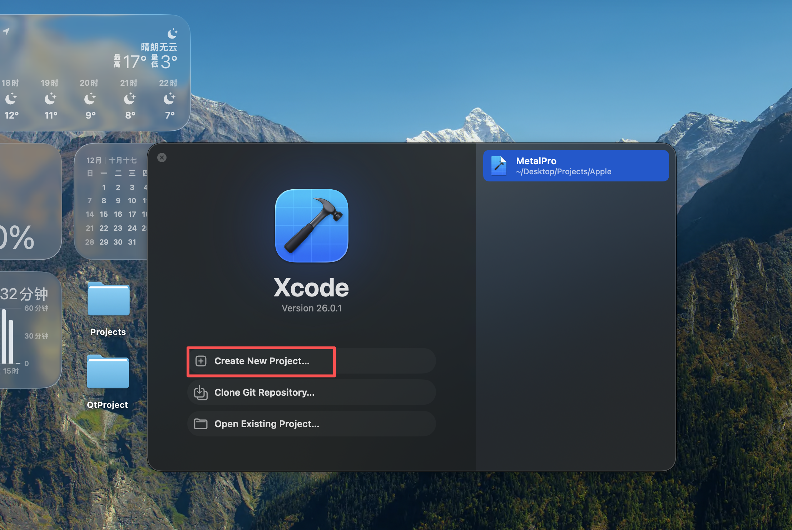
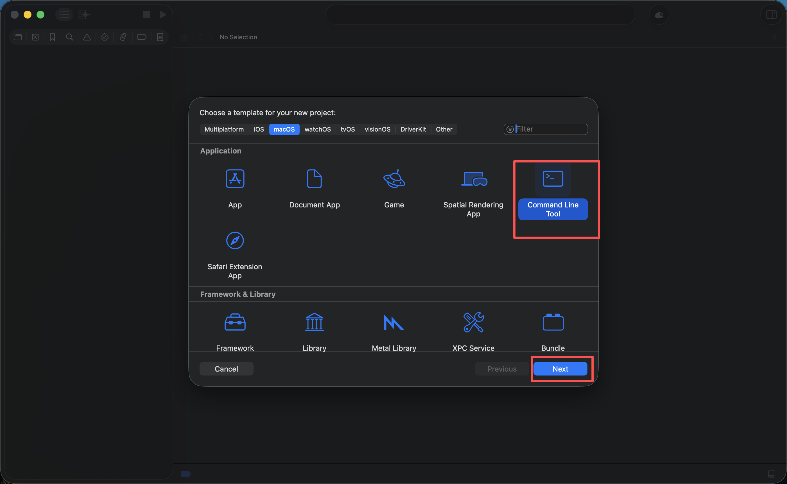
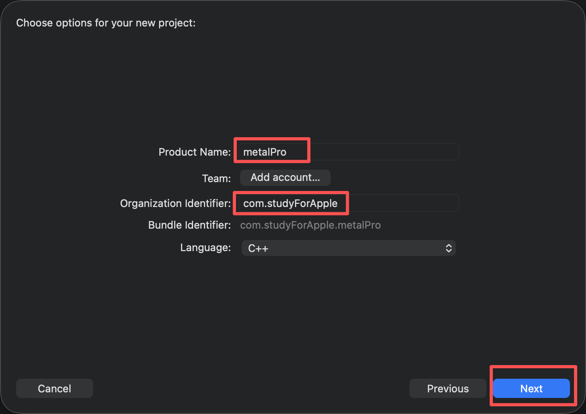
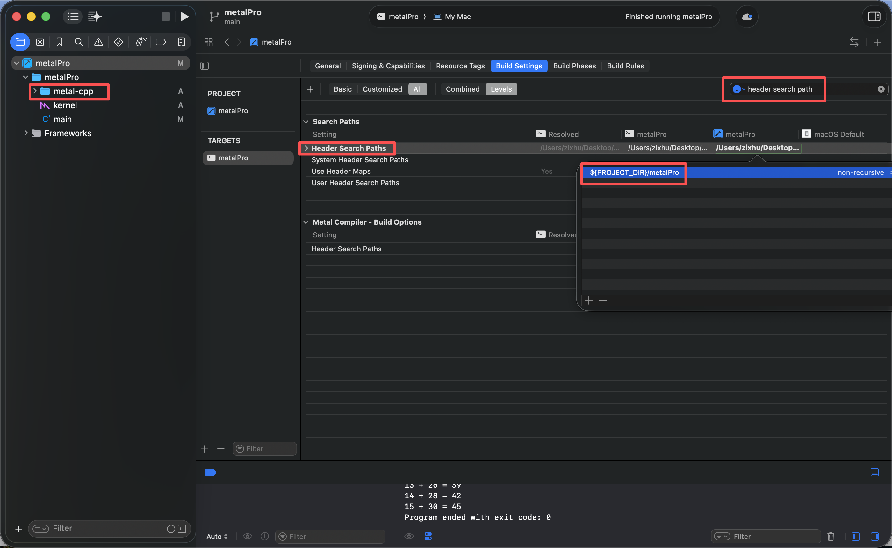
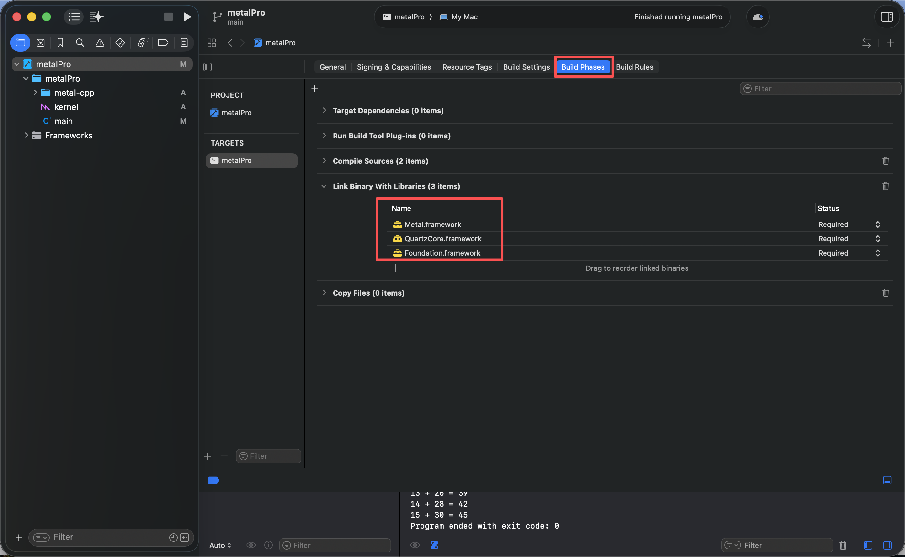
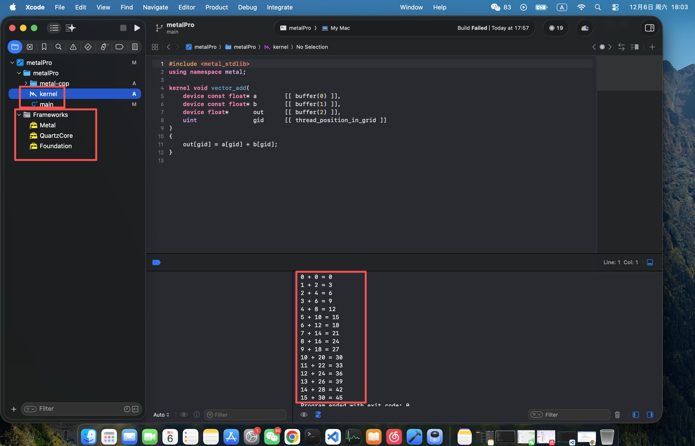

### Metal Compute Pipeline：Metal-C++ 环境配置与简单算子实现

>本文目标：使用Metal + C++实现一个可运行的GPU compute算子，覆盖内容：工程创建、metal-cpp引入、kernel编写、host调用、最终运行
前置要求：macOS + Xcode 15+，Metal-capable GPU

#### 一、项目创建
这步主要是创建Xcode Command Line Tool工程
具体步骤如下所示：






#### 二、引入 Metal-C++
资源文件请到该url中下载
https://developer.apple.com/metal/cpp/
将下载后的metal-c++放到项目中，项目结构如下所示：
```
zixhu@MacBook metalPro % tree -L 2
├── kernel.metal
├── main.cpp
└── metal-cpp
    ├── Foundation
    ├── LICENSE.txt
    ├── Metal
    ├── MetalFX
    ├── QuartzCore
    ├── README.md
    └── SingleHeader
```

#### 三、build参数配置
配置如下所示：



由于metal-cpp是从外部引入的第三方头文件，因此需要在 Xcode中进行基础的路径和框架配置，确保工程能够正常找到相关的API和系统库；

metal-cpp的头文件依赖系统原生框架，因此还需要在编译阶段将以下框架加入链接列表：
Foundation.framework
QuartzCore.framework
Metal.framework

#### 四、kernel编写
代码如下：
```
#include <metal_stdlib>
using namespace metal;

kernel void vector_add(
    device const float* a        [[ buffer(0) ]],
    device const float* b        [[ buffer(1) ]],
    device float*       out      [[ buffer(2) ]],
    uint                gid      [[ thread_position_in_grid ]]
)
{
    out[gid] = a[gid] + b[gid];
}

```

#### 五、host编写
```
#define NS_PRIVATE_IMPLEMENTATION
#define CA_PRIVATE_IMPLEMENTATION
#define MTL_PRIVATE_IMPLEMENTATION

#include <vector>
#include <iostream>
#include "Metal/Metal.hpp"
#include "Foundation/Foundation.hpp"
#include "QuartzCore/QuartzCore.hpp"

int main() {

    const int count = 16;

    // 1. 创建设备
    MTL::Device* device = MTL::CreateSystemDefaultDevice();
    if (!device) {
        std::cerr << "No Metal device found.\n";
        return -1;
    }

    // 2. 加载库
    MTL::Library* library = device->newDefaultLibrary();
    
    if (!library) {
        std::cerr << "Failed to load default library!\n";
        std::cerr << "Make sure kernel.metal is added to your Xcode project.\n";
        return -1;
    }

    // 3. 获取 kernel 函数
    NS::String* functionName = NS::String::string("vector_add", NS::UTF8StringEncoding);
    MTL::Function* function = library->newFunction(functionName);
    
    if (!function) {
        std::cerr << "Failed to find function 'vector_add'.\n";
        
        // 调试
        std::cout << "Available functions in library:\n";
        NS::Array* functionNames = library->functionNames();
        for (size_t i = 0; i < functionNames->count(); ++i) {
            NS::String* name = reinterpret_cast<NS::String*>(functionNames->object(i));
            std::cout << "  - " << name->utf8String() << std::endl;
        }
        
        return -1;
    }

    // 4. 创建 pipeline
    NS::Error* error = nullptr;
    MTL::ComputePipelineState* pipeline = device->newComputePipelineState(function, &error);
    
    if (!pipeline) {
        std::cerr << "Failed to create pipeline: ";
        if (error) {
            std::cerr << error->localizedDescription()->utf8String();
        }
        std::cerr << std::endl;
        return -1;
    }

    // 5. 准备数据
    std::vector<float> a(count), b(count);
    for (int i = 0; i < count; i++) {
        a[i] = static_cast<float>(i);
        b[i] = static_cast<float>(i * 2);
    }

    // 6. 创建 buffers
    MTL::Buffer* bufA = device->newBuffer(a.data(),
                                          count * sizeof(float),
                                          MTL::ResourceStorageModeShared);
    MTL::Buffer* bufB = device->newBuffer(b.data(),
                                          count * sizeof(float),
                                          MTL::ResourceStorageModeShared);
    MTL::Buffer* bufOut = device->newBuffer(count * sizeof(float),
                                            MTL::ResourceStorageModeShared);

    // 7. 创建命令队列和缓冲区
    MTL::CommandQueue* queue = device->newCommandQueue();
    MTL::CommandBuffer* cmd = queue->commandBuffer();
    MTL::ComputeCommandEncoder* encoder = cmd->computeCommandEncoder();

    // 8. 设置计算参数
    encoder->setComputePipelineState(pipeline);
    encoder->setBuffer(bufA, 0, 0);
    encoder->setBuffer(bufB, 0, 1);
    encoder->setBuffer(bufOut, 0, 2);

    // 9. 计算线程组大小
    NS::UInteger maxThreads = pipeline->maxTotalThreadsPerThreadgroup();
    NS::UInteger threadsPerGroup = std::min(maxThreads, static_cast<NS::UInteger>(count));
    
    // 创建MTL::Size对象
    MTL::Size gridSize = MTL::Size::Make(count, 1, 1);
    MTL::Size groupSize = MTL::Size::Make(threadsPerGroup, 1, 1);

    // 10. 调度线程
    encoder->dispatchThreads(gridSize, groupSize);
    encoder->endEncoding();

    // 11. 提交并等待完成
    cmd->commit();
    cmd->waitUntilCompleted();

    // 12. 获取并打印结果
    float* result = reinterpret_cast<float*>(bufOut->contents());
    for (int i = 0; i < count; i++) {
        std::cout << a[i] << " + " << b[i] << " = " << result[i] << std::endl;
    }

    // 13. 清理资源
    encoder->release();
    cmd->release();
    queue->release();
    bufA->release();
    bufB->release();
    bufOut->release();
    pipeline->release();
    function->release();
    library->release();
    device->release();

    return 0;
}


```

#### 六、编译&&运行


>由于笔者也是在学习过程中，因此难免有写的不严谨的地方，还请多多包涵！！
